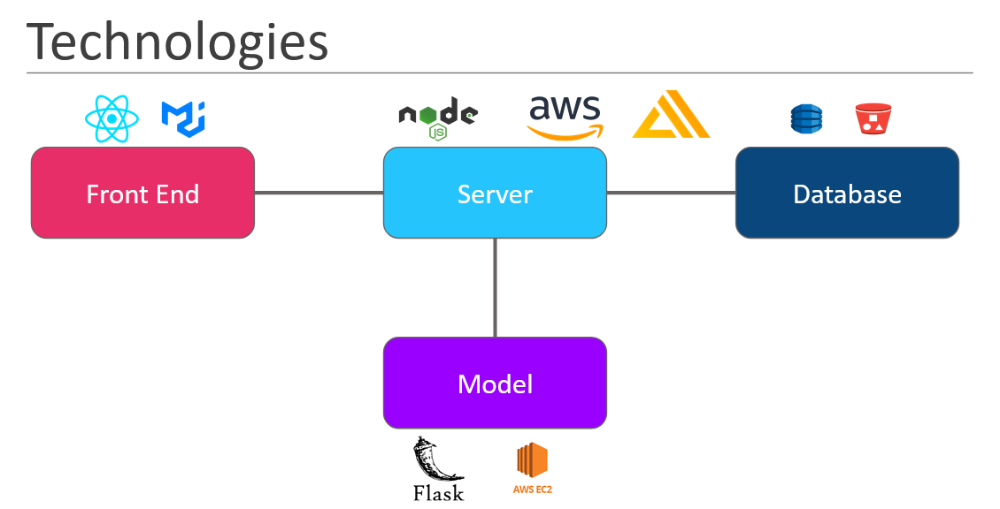
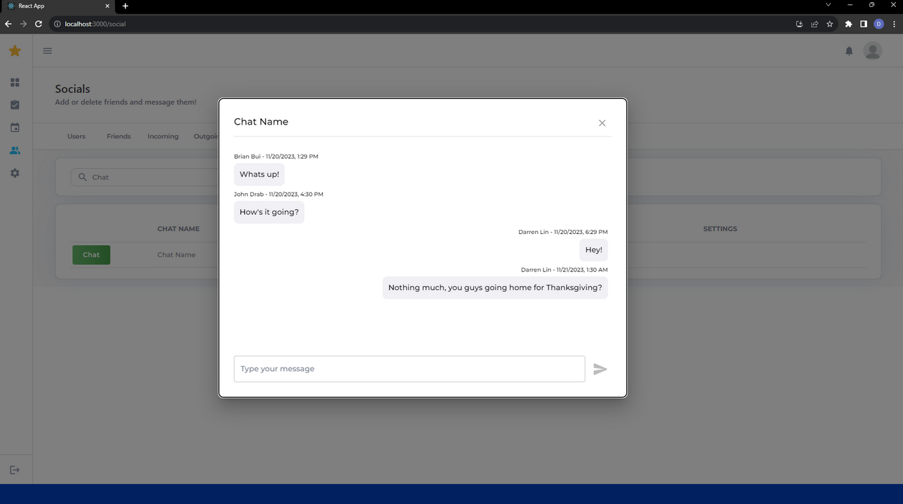

# Objective
A networking application for University of California, Santa Cruz Alumni to volunteering opportunities, finding qualified volunteers, and posting volunteering opportunities

## My Contributions
I had been part of the Fall 2023 team in CSE-115D (Accelerated Software Design Project) as the Scrummaster and worked together with the Project Lead and five Developers to improve the application to work extensively with social aspects. 

We spent two weeks onboarding with the existing codebase and to touch up on our coding knowledge. The next eight weeks consisted of 4 sprints following the Agile software development methodology as I documented our work done and 

## Aproach
React front-end framework for UI/UX
MaterialUI for accessibility and visual components
Node.js for local development
AWS Amplify for live server and database
DynamoDB for object schema and table relations
S3 buckets for media storage

### Features our team implemented
Friend Requests
### Real-time Chatting

Machine Learning Recommendation Engine
Modularity and Documentation for future teams to improve the application on